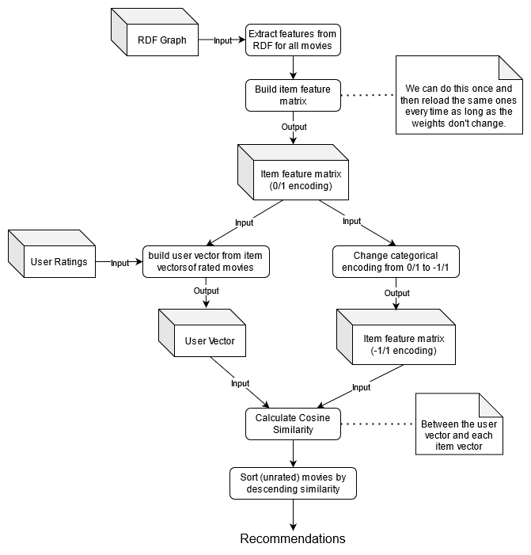
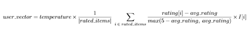

# MovieRecommender

### Summary

In this project we build a **content-based recommender system** for movies. In content-based recommendation, it is paramount to find appropriate features for the items at hand (i.e. the movies), based on which we can calculate a reliable similarity metric between them. This is where knowledge bases and knowledge extraction comes in. We build an RDF graph containing all the data from the official IMDb dataset that we deemed most useful and, then, we enrich it with relevant info from other online RDF knowledge bases such as wikidata (https://www.wikidata.org/). Having done that, we are able to use SPARQL in order to query from said knowledge graph all the features we need for our task.

### Content-Based Recommendation

#### What you need to know

In order to calculate similarity between movies we represent each item/movie as a point in some high-dimensional Euclidean space by constructing a real vector from the features of each movie. We can then calculate the similarity between movies by using the **cosine similarity** of their respective feature vectors. 

There are two types of features:
* **Numerical features** (e.g. year): which take up one dimension of item vectors and are normalized in [0, 1].
* **Categorical features** (e.g. genres): which take up as many dimensions as there are possible values for them. We employ a multi-label binary encoding for these features where each element is 1 if the corresponding feature value is valid for the item and 0 otherwise (that is multiple values are possible).

Each feature may not be as important. Furthermore, numerical feature may be overshadowed by categorical features (which take up more "spots") when using this encoding. Therefore, we correspond to each feature a **weight** by which we multiply all its values in the feature vector. The higher the weight of a feature the more "say" this feature has for our final recommendations. These are, of course, hyperparameters of the process.

#### How it works

We can summarize how we have implemented our content-based recommender system with the following flow diagram.

The process can be described as follows:
1. We begin by extracting all the features to use from our enriched RDF graph and **constructing the item feature matrix**. We do this by creating each item vector individually out of the features of the corresponding movie as queried from the RDF graph. Here we need to treat numerical and categorical features appropriately (as previously described) as well as multiply them by their weights. 
    Extra care had to be given to reduce the amount of possible values for categorical features with too many possible values (e.g. we reduced the 84.000 actors to 13.000 of them that had made at least 3 movies).
   
Then, each time we get called to make recommendations for a user given ratings of his to movies we do the following:

2. We **create the user vector**, describing the user's **estimated preferences** in movies, by aggregating *appropriately* the item vectors in the item feature matrix that correspond to movies that the user has rated. For numerical features, this aggregation may simply be the sample mean or the median. For categorical features, however, we want to weight each value based on the difference between the user's rating and the average rating (e.g. either fixed to 2.5 out 5 or the average rating that the user has given in his ratings). When this is positive then it is desirable for a movie to have this categorical value in order to be more similar to the user's preferences, whilst when it is negative then it's not.  
   
    After much consideration, the formula we ended up using for item feature matrix <i>I</i> (with 0/1 encoding) is the following: 

    
   
   Here, *temperature* is another hyperparameter of the process. Higher *temperature* results in more "extreme" estimations in that less ratings are needed to reach the maximum/minimum value for a feature value (e.g. the less % of comedies one would need to watch for their estimated preferences for comedies to be close to 1 times the weight of the genre feature).   Also, note that the weights of each feature are already incorporated in the item feature matrix and that we clip the results of this formula in the range of [-w, w] for each categorical feature with weight w. 

3. We modify the item feature matrix (a copy of it) to have an encoding of -1/1 instead of 0/1 for the categorical features. This makes more sense for our impending cosine similarity calculation between user and item vectors since now the item vector's values will conveniently be in the exact same range of [-w, w] for each feature with weight w as the user vector's values. 

4. Finally, we calculate the cosine similarity between the user vector and all the item vectors in the modified item feature matrix (with -1/1 encoding) and sort all movies by descending similarity. Our recommender can simply recommend to the user the top N most similar movies that weren't in his user ratings (i.e. that he hasn't watched yet).
